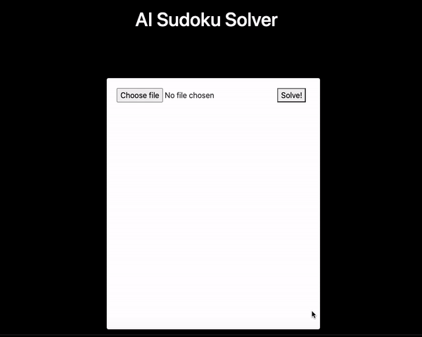

# Sudoku-AI 

A web application in which <b>AI</b> solves the game of <b>Sudoku</b>!

## Overview

Sudoku is a logic-based, combinatorial number-placement puzzle. In classic sudoku, the objective is to fill a 9×9 grid with digits so that each column, each row, and each of the nine 3×3 subgrids that compose the grid contain all of the digits from 1 to 9.

## Flow of the app:

The app is divided into <b>3</b> main parts:

<b>1. Uploading a Sudoku game image:</b>
<ul>
  <li>A user uploads a picture of the sudoku which is needed to be solved.</li>
  <li>The uploaded image is then sent to the <b>Flask</b> server.</li>
</ul>

<b>2. Cell Extraction & Digit Recognition:</b>
<ul>
  <li>The uploaded image once recieved at the Flask server is then preprocessed.</li>
  <li>For preprocessing, the image goes through many processes such as Adaptive Thresholding, Binary Inversion, Dilation, Flood-Filling & Erosion.</li>
  <li>This helps in finding the biggest blob i.e. border of the sudoku(incase of improper image).</li>
  <li>Then, lines are drawn on the image to find the borders of the sudoku board. The required part is then cropped and used for further purposes.</li>
  <li>Once the sudoku board is extracted, the board is divided into 81 cells. This helps in digit recognition.</li>
  <li>Each cell image is then reshaped into (28, 28, 1) which is the shape of images in the MNIST(handwritten digits dataset) on which the model has been trained.</li>
  <li>CNN(Convolution Neural Networks) was used for training on the images if the MNIST dataset. (<i>Some articles suggested KNN(K-Nearest Neighbours) is a better approach. Worth trying in the future.</i>)</li>
  <li>The model predicts on each cell image. Flood-filling was done on the cell images. If any image consists less than 5 white pixels, it is considered as an empty cell and assigned a value 0, else the model predicts the number in the cell from the cell image.</li>
  <li>To know more view the <b>preprocess.py</b> and <b>recognition.py</b> files.</li>
</ul>

<b>3. Solving the Sudoku:</b>
<ul>
  <li>The extracted digits are then fed into another model.</li>
  <li>This model has been trainined on the <b>1 million Sudoku games</b> dataset. You can download it from <a href="https://www.kaggle.com/bryanpark/sudoku/download">here</a></li>
  <li>The model then predicts the numbers that will fill the empty spaces and renders it back to the web page.</li>
  <li>To know more view the <b>solver.py</b> file.</li>
</ul>

<i>The trained models are present in the <b>models</b> folder.</i>

## Demo



## Getting started

1. Clone and download the repo
```bash
  git clone <this_repo_url>
```

2. Download the required python packages
```bash
pip install -r requirements.txt
```

3. Start the Flask server
```bash
python app.py
```

4. Open <b>localhost:5000/solve<b> in the browser.

## Limitations & Future Scope

<ul>
  <li>Extraction of the Sudoku board is not extremely accuarate in some cases.</li>
  <li>KNN instead of CNN for digit recognition.</li>
  <li>Accuracy of the models can be worked on.</li>
</ul>

&nbsp;<b><i>Will work on these in the future!</i><b>

## License

[](https://opensource.org/licenses/MIT)

[MIT License Link](https://github.com/sherwyn11/Sudoku-AI/blob/master/LICENSE)

<br>
&copy; Sherwyn D'souza 2020
